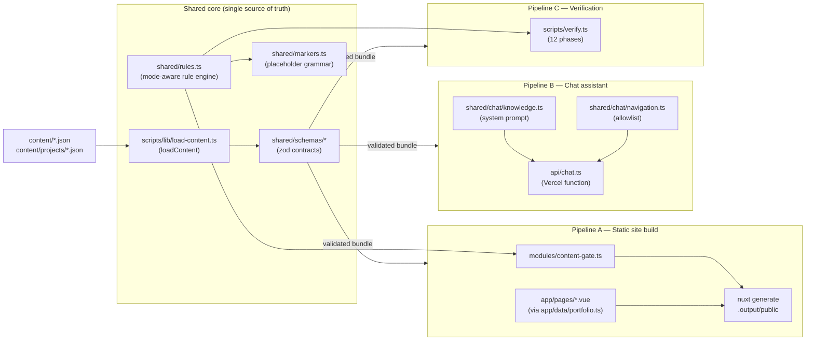

# System Architecture — Pseudocode Reference

Companion to [docs/repository.md](repository.md). That doc says *what* each
piece is; this one traces *how data actually flows* through the three
pipelines that make up the site, in pseudocode, so the control flow is
readable without opening seven files at once.

All three pipelines share one core — this is the whole point of the design
(CLAUDE.md rules 1–5): a claim can't drift between what the build enforces,
what the CLI reports, and what the chat assistant knows, because there is
only one rule engine and one schema set, imported three times.



---

## Shared core, in one paragraph

Every JSON file under `content/` is parsed and checked against a zod schema
from `shared/schemas/` — never regexed (CLAUDE.md rule 3). The result is a
`ContentBundle`. `shared/rules.ts` walks that bundle and, depending on
`mode` (`demo | review | production`), emits `Finding[]` — placeholder
markers, enabled demo content, numeric claims outside evidence-labeled
`Claim` objects, broken cross-references, missing featured project, etc.
Three callers run this exact function and can therefore never disagree:
the build gate, `npm run check:owner-content`, and the test suite.

```
FUNCTION load_content() -> { bundle, issues }:
  issues = []
  FOR EACH (file, key, schema) IN CONTENT_MANIFEST:      # profile, education, interests,
    json = READ_JSON("content/" + file)                  # experience, learning, principles,
    result = schema.safeParse(json)                      # contact, process, now, colophon
    IF result.failed: issues.append(file, result.errors)
    ELSE: bundle[key] = result.data

  FOR EACH file IN "content/projects/*.json":
    project = projectSchema.safeParse(READ_JSON(file))
    IF project.failed: issues.append(file, project.errors)
    ELSE:
      ASSERT project.slug == filename_without_ext(file)  # prerender routes derive from this
      bundle.projects.append(project)

  IF issues NOT empty: RETURN { bundle: null, issues }   # partial bundles never ship
  RETURN { bundle, issues: [] }


FUNCTION run_content_rules(bundle, mode) -> Finding[]:
  findings = []
  severity_for_marker(type) =
    mode == "production"              -> "error"
    type == "REPLACE_BEFORE_PRODUCTION" -> "warning"
    mode == "review"                  -> "warning"
    ELSE                              -> "info"

  # 1. placeholder markers: [DEMO] [PLACEHOLDER:] [OWNER_INPUT_REQUIRED:] [REPLACE_BEFORE_PRODUCTION:]
  FOR EACH marker IN collect_markers(bundle, skip_disabled_projects=true):
    findings.add(severity_for_marker(marker.type), marker.path, marker.note)

  # 2. demo projects still enabled                    -> error in production
  # 3. demo images (cover/portrait/gallery)            -> error in production
  # 4. placeholder or http:// links anywhere in content -> error in production
  # 5. achievement-shaped numbers ("37%", "$50k", "120 users") outside a
  #    labeled Claim object, in prose fields or workflow steps -> error in production
  # 6. broken cross-references: pillar->project slug, experiment->project slug -> always error
  # 7. zero enabled+featured projects                  -> always error
  # 8. contact.email not a real address                -> error, production only
  # 9. site URL missing/placeholder/not https           -> error, production only
  # 10. enabled real (non-demo) project with zero public links -> info (disclosure nudge)

  RETURN findings

FUNCTION worst_severity(findings) -> "error" | "warning" | "info" | null
```

---

## Pipeline A — Content → static site

Entry points: `nuxt dev`, `nuxt build`, `nuxt generate` (all three run the
gate; it cannot be skipped by calling `nuxt` directly, unlike an npm
prebuild hook).

```
FUNCTION build_site():
  mode = env.NUXT_PUBLIC_PORTFOLIO_MODE OR "review"

  # 1. content-gate.ts — runs as a Nuxt module, inside every build
  { bundle, issues } = load_content()
  IF bundle == null:
    ABORT build, print "Content failed schema validation:" + issues

  findings = run_content_rules(bundle, mode, siteUrl = env.NUXT_PUBLIC_SITE_URL)
  errors = findings.filter(severity == "error")
  IF mode == "production" AND errors NOT empty:
    ABORT build, print "Production build blocked — N unresolved issue(s):" + errors
  ELSE:
    LOG "content-gate: mode=" + mode + ", " + counts_by_severity(findings)

  # 2. app/data/portfolio.ts — the SAME schemas parse content again at the
  #    app layer (Vite import, not Node fs) so every page component reads
  #    already-validated, already-sorted data
  projects = glob("content/projects/*.json")
    .map(projectSchema.parse)
    .filter(p => p.enabled)
    .sort_by(featured DESC, status_maturity, editorial_order, name)

  # 3. routes are DERIVED, never hardcoded (CLAUDE.md rule 4) — a new
  #    content/projects/*.json file becomes a route with zero config edits
  routes = STATIC_ROUTES + ["/projects/" + p.slug FOR p IN projects IF p.enabled]

  # 4. prerender every route to static HTML; crawlLinks fills in the rest
  FOR EACH route IN routes:
    WRITE_STATIC(render(route, bundle, projects))

  sitemap = derive_from(routes)          # @nuxtjs/sitemap module
  RETURN ".output/public"                # zero server runtime except api/chat.ts
```

Key invariant: **the app never trusts unparsed JSON.** `app/data/portfolio.ts`
re-parses every file through the identical zod schema the loader uses — a
malformed file fails `nuxt generate` in *every* mode, independent of the
mode-aware rule engine above.

---

## Pipeline B — Chat assistant (`api/chat.ts`)

The only server code in an otherwise fully static site: one Vercel
function, cold-started per instance, that answers the floating "Ask"
widget.

```
ON cold_start:                                    # once per serverless instance
  TRY:
    { bundle } = load_content()                   # same loader as the build
    system_prompt = build_system_prompt(bundle)    # ~15k tokens; mirrors the
                                                     # Skills/"What I bring" prose
                                                     # hardcoded in about.vue —
                                                     # must change in the same commit
    allowlist = build_nav_allowlist(bundle.projects)  # every real, static page
                                                        # anchor + every enabled,
                                                        # non-demo project's route
                                                        # and section anchors
    loaded = { system_prompt, allowlist }
  CATCH any_error:
    loaded = null                                  # this instance answers 503
                                                     # for its whole lifetime
    LOG error.name                                 # never the content, never a visitor message


FUNCTION handle_chat(request) -> response:
  response.header("Cache-Control", "no-store")      # never cache a conversation

  IF request.method != "POST":                 RETURN 405
  IF NOT is_allowed_origin(request.origin):    RETURN 403   # soft same-origin tripwire
  IF byte_length_utf8(request.body) > MAX_BODY_BYTES:
                                                RETURN 400   # bytes, not chars — Khmer is 3 bytes/char
  parsed = chatRequestSchema.safeParse(request.body)
  IF parsed.failed:                            RETURN 400

  # offline check BEFORE the rate limiter — a dead assistant must not also
  # spend the visitor's quota telling them it's dead
  IF NOT env.ANTHROPIC_API_KEY OR loaded == null:
                                                RETURN 503 "assistant offline"

  retry_after = rate_limiter.check(client_ip(request))
    # decide-first-consume-second: buckets are
    #   per-IP/minute(8) · per-IP/day(60) · global/minute(40) · global/day(500, per INSTANCE)
    # a request already being refused increments nothing
  IF retry_after != null:
                                                RETURN 429 with Retry-After header

  TRY:
    history = drop_leading_turns_until_role(parsed.history, "user")   # API requires user-first
    messages = history + [{ role: "user", content: parsed.message }]

    api_response = anthropic.messages.create(
      model: "claude-haiku-4-5",
      system: [{ text: loaded.system_prompt, cache_control: ephemeral, ttl: "1h" }],
      messages: messages,
      output_schema: CHAT_REPLY_JSON_SCHEMA,       # forces {reply, navigateTo, suggested[]}
      max_tokens: 1024, timeout: 20s, retries: 1
    )

    LOG counters_only(tokens_in, tokens_out, cached_tokens, stop_reason)  # no message content, ever

    IF api_response.stop_reason IN {"refusal", "max_tokens"}:
      RETURN 200, FALLBACK_REPLY

    reply = JSON.parse(api_response.text)
    reply = chatReplySchema.safeParse(reply) OR RETURN 200, FALLBACK_REPLY
    reply.navigateTo = allowlist.has(reply.navigateTo) ? reply.navigateTo : null
    reply.suggested = reply.suggested.filter(0 < length <= 200).take(3)
    RETURN 200, reply

  CATCH RateLimitError OR InternalServerError:
    RETURN 503 "briefly unavailable"
  CATCH other_error:
    LOG error.name only
    RETURN 502 "could not answer"
```

Key invariant: **the model's `navigateTo` is never trusted directly** —
`validateNavigateTo()` is an exact-match against a route allowlist
*derived* from the same content the build renders, so the assistant can
only ever send a visitor somewhere the static site actually built.

---

## Pipeline C — Verification (`npm run verify`)

One command, ordered cheap-to-expensive, that a human or CI runs before
calling anything "done."

```
FUNCTION verify():
  mode = env.NUXT_PUBLIC_PORTFOLIO_MODE OR "review"

  steps = [
    "check:structure",                     # repo layout sanity
    "check:secrets",                       # secret scan
    "check:content",                       # zod schema pass over content/
    "check:owner-content" (mode),          # run_content_rules() at current mode
    "lint", "typecheck", "test",
    "generate",                            # full nuxt generate — exercises the gate for real
    "check:links", "check:a11y", "check:seo"
  ]

  # Gate self-test: prove the production gate actually gates, not just that
  # it ran. If unresolved production-blocking issues exist, forcing
  # mode=production here MUST fail — a pass would mean the gate is broken.
  production_errors = run_content_rules(load_content().bundle, mode="production")
  gate_should_fail = production_errors NOT empty
  steps.append(
    "check:owner-content --mode=production",
    expect_failure = gate_should_fail
  )

  FOR EACH step IN steps (IN ORDER):
    result = RUN(step)
    ok = step.expect_failure == undefined
           ? result.succeeded
           : (result.failed == step.expect_failure)
    IF NOT ok:
      PRINT step.output
      PRINT "FAIL — stopping here"
      EXIT 1
    PRINT "PASS (" + elapsed + "s)"

  PRINT "ALL " + steps.length + " PHASES PASSED"
```

Key invariant: **verify stops at the first failure** (no "run everything,
report at the end") — later phases assume earlier ones held, e.g.
`check:links`/`check:a11y`/`check:seo` inspect `.output/public`, which only
exists if `generate` succeeded.

---

## Where each pipeline is triggered from

| Pipeline | Triggered by | Can it be bypassed? |
|---|---|---|
| A — Build | `npm run dev/build/generate`, Vercel build | No — the gate is a Nuxt module, runs inside `nuxt` itself |
| B — Chat | `POST /api/chat` (any request to the deployed function) | N/A — stateless per request; a broken bundle takes the whole instance offline (503) rather than serving ungrounded answers |
| C — Verify | `npm run verify` (manual or CI) | Yes, in the sense that nothing forces a human to run it — it is the recommended pre-"done" gate, not an enforced hook |

## Related docs

- [docs/repository.md](repository.md) — the what/where table this doc expands into how
- [docs/chat-assistant.md](chat-assistant.md) — operations guide for Pipeline B (env vars, rate limits, evals)
- [docs/content-replacement-guide.md](content-replacement-guide.md) — how to satisfy the rule engine when filling in `OWNER_INPUT.md`
- `../CLAUDE.md` — the non-negotiable rules this architecture exists to enforce
